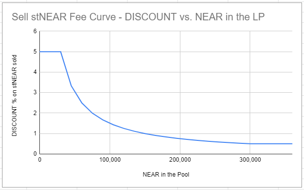

# Diversifying Staking Pool

## Overview

This contract provides the following value items:

### Don't Put All your Eggs in One Basket
* This contract acts as an staking-pool but distributes it's delegated funds in several validators. By delegating to this contract, users greatly reduce the risk of getting no-rewards because validators' outage events and also get averaged validators' fees. Besides rewards, SKASH holders reveive governance tokens G-SKASH

### I need my staked funds NOW
* This contract allows users to skip the waiting period after unstaking by providing a liquidity pool for inmediate unstaking. This provides also the opportunity for liquidity providers to earn fees for their service. 

### I want to earn fees by providing liquidity
* This contract includes severael liquidity pools and the opportunity for liquidity providers to earn fees. The basic pools are NEAR/SKASH and SKASH/G-SKASH, where SKASH are staked nears, and G-SKASH are governance tokens.

## SKASH Tokens

This contract allows users to treat staked near as a TOKEN, called **SKASH**.

SKASHs repesent staked NEARS, and can be transferred between contract users and swapped with NEAR in the NEAR/SKASH Liquidity Pool (paying a fee to skip the unstaking wait period). The amount of SKASH you hold is automatically incremented each epoch when staking rewards are paid. This contract includes a Trip-meter functionality for the users, so you can preciseliy measure rewards received.

## Immediate Unstakings & Staking at Discounted Price

Users wanting to unstake skipping the waiting period can do so in the *NEAR/SKASH Liquidity Pool*.

In the Liquidity Pool:
 * Users providing liquidity can earn operation fees
 * Users wanting to unstake without the waiting period can do so for a fee

The *NEAR/SKASH Liquidity Pool* is an unbalanced Liquidty pool, since most of the the time there will be big amounts of SKASH and a limited amount of NEAR liquidity. Liquidity providers add only NEAR to the liq. pool. The Liq. pool allows other users to SELL SKASH for NEAR (unstake) at a discounted price. The discount represents how much users value not to wait 36-48hs to receive their funds. The discount varies with the amount of NEAR in the liq. pool, but the curve is capped. By default discount fees are in the ranege 1-10%, but the curve parameters can be changed by the G-SKASH governance tokens holders.

## Standard staking-pool

This contract also has the interface and acts as a standard staking-pool, so users can perform classical stakes and unstakes (with the corresponding waiting period + 1h for the diversification mechanism).

## Lockup contracts

By implementing the standard-staking-pool trait, *lockup contracts* can delegate funds here, gaining risk reduction and fee-averaging. Lockup contracts can only perform classic stake/unstake so Lockup contracts *can not* access the liquidity pools, buy or sell SKASH.

## Decentralization

This contract helps the community by increasing decentralization, spliting large sums automatically betweeen several validators.

## Technical details

The contract pools all users' funds and mantains a balanced distribution of those funds in a list of whitelisted, low-fee, high-uptime validators.

Staking and unstaking distribution is done in batches during calls to this contract `heartbeat()` function so actual staking and unstaking are delayed. 

To avoid impacting staking-pools with large unstakes, this contract has a maximum movement amount during heartbeat (this is transparent to users). E.g. if a user stakes 1m NEAR, the staking is distributed between selected pools in 100K batches.

This batch mechansim ensures a good distribution of large sums between the pools, and that no pool is adversely affected by a large unstake.

## Operational costs

Periodic calls to `distribute()` are required for this contract operation. This calls consume gas that is mostly paid by the operator. To fund this operational cost, a owner's fee percentage (0.5% by default) is taken from rewards distributions. It can be adjusted by G-SKASH governance token holders.

### Guarantees

(To verify)
- The users can not lose tokens or block contract operations by using methods under staking section.
- Users owning SKASHs will accrue rewards on each epoch, except in the extreme unlikely case that all the selected validators go offline during that epoch.

## Use Cases

Definitions:

SKASH: one SKASH represents one staked NEAR. A SKASH is a virtual token computed from the user’s share in the total staked funds. By staking in the diversifying pool a user mint SKASHs, by unstaking, SKASHs are burned, when rewards are paid, new SKASH are minted an distributed.

--- To BUY SKASH is equivalent to STAKE  ---

--- To SELL SKASH is equivalent to UNSTAKE without the waiting period ---

**To buy SKASH and to stake are the same operation for the user.**

In order to stake the user buys SKAHS tokens. Buy SKASH/Stake are the same operation. When buying SKASH the price is always fixed 1 NEAR = 1 SKASH

**To sell SKASH and to un-stake are similar.**

There are two ways to un-stake: (from more convenient to less convenient)

1. Sell SKASH at a discount price. You un-stake by selling SKASH (staked NEAR). Since you’re unstaking without waiting 36-48hs (you’re passing that waiting penalty to other users) you get a discounted price. The discount is the value you place on not-waiting 48hs. E.g. you sell 100 SKASH (unstake) for 99 NEAR and get the near immediately without waiting 48hs.

2. Classical unstake. The contract unstakes your NEAR from the staking-pools. You burn SKASH tokens and get unstaked-near. You get 1:1 ratio (you don’t get a discounted price as in option 1), but you must wait 36-48hs to move those funds to your account. Your funds must remain unstaked in the staking-pools for 3 or 4 epochs (36-48 hs) before you can withdraw. E.g. you unstake 100 SKASH, and you get 100 unstaked-near, 48hs later you can move your unstaked-near to your “available” balance and then withdraw to your own near account.

This operations are reflecte in the UI in two steps the user must complete with 36-48hs between the two: [START UNSTAKE] and [COMPLETE UNSTAKE]

In order to provide the first options (buy/sell SKASH) a Liquidity Pool and a SELL SKASH mechanism are provided by the contract:

* TO SELL SKASH: The sellers enter how much SKASH they want to sell and the contract replies with the NEAR amount they will receive, normally with a discount 1%-10%, depending on the NEAR balance of the liquidity pool and the fee curve parameters.

## Treasury
Part of the NEAR/SKASH LP fees goes to the DAO Treasury. Treasury funds are always SKASH and used for:

* DAO Maintenance
* DAO Expansion
* Dividends

The contract has a configurable parameter `dev_mateinance_amount`, initially 2500 SKASH transferred monthly to the account `developers.near`. By DAO governance, this value can be increased and 
G-SKASH gov-token holders can also re-direct up to 50% of manteinance funds to other mantainers and contributors.

## Governance
G-SKASH holders can vote on:
* Diversification: Validator distribution list, and how much NEAR to distribute to each one.
* `distribute()` Batch stake size. By default 100-150K NEAR
* Fee curve parameters for the NEAR/SKASH Liquidity Pool (min fee, max fee, slope)
* How to use treasury funds for DAO expansion
* Maintenance funds redirections
* Move treasury funds to the dividends-pool

Half of treasury funds must be used for DAO expansion and manteinance. The other 50% can be user for expansion by presenting proposals, o can be moved to the dividends-pool (once a month). 

The Dividends-pool is a SKASH/G-SKASH liquidity pool allowing G-SKASH owners to burn G-SKASH to obtain SKASH. This pool sets a base-price for G-SKASH tokens. When users vote to add SKASH to the dividends-pool, G-SKASH base-price is incremented. Users can also vote to remove SKASH from the dividends-pool back to the treasury, lowering the G-SKASH base price.

Users get G-SKASH tokens minted for them when:
* They receive rewards for holding SKASH
* They receive fees in the NEAR/SKASH Liquidity pool (by being a Liquidity Provider)

So, G-SKASH governance tokens are minted and distributed to users holding SKASH and to users providing liquidity.

## User stories:
### Alice
Alice wants to stake her NEAR with low risk, and also help the community by promoting validators diversification. 
Alice opens an account in the contract: diversifying.pool.near

Alice deposits 750_000 NEAR in her div-pool account. 
Alice buys 750_000 SKASH. Her 750_000 NEAR are distributed between the staking-pools by an automatic distribution mechanism to keep the validators balanced. 

She starts earning staking rewards on her SKASH. She will also get G-SKASH gov tokens.
By holding SKAHS she has the posibbility to sell some of her SKASH skipping the waiting period if the need arises.

### Bob
Bob already has an account in the diversifying-pool conract. He has 10_000 SKASH earning rewards. 

Bob needs to unstake 5_000 NEAR to use in an emergency. He can’t wait 36-48hs to get his NEAR. 

Bob sells 5_050 SKASH for 5_000 NEAR. He sells at a 1% discounted price to get the NEAR immediately.
Bob gets the NEAR in his div-pool account.
Bob can withdraw his NEAR immediately.

### Carol
Carol is an investor. She wants to provide liquidity for the NEAR/SKASH pool for a short period, earning operation fees.
Carol deposits 7_000 NEAR in her div-pool account
Carol adds her 7_000 NEAR to the NEAR/SKASH liquidity pool, she is the first in the pool, so she gets 7_000 shares of the N/S-liq-pool.

Bob swaps 5_050 SKASH for 5_000 NEAR. He sells at a 1% discounted price to get the NEAR immediately. The N/S-liq-pool delivers 5_000 NEAR to Bob and acquires 5_050 SKASH from Bob. The new value of the N/S-liq-pool is 7_050 NEAR (2000 NEAR+5050 SKASH), 

Carol shares value have increased, and now she owns some SKASH via the N/S-liq-pool. Carol burns all her shares and retieves 2_000 NEAR and 5_050 SKASH into her account. Carol has now 7_050 NEAR. Carol earned 0.7% in a few epochs.
Had her normaly staked 7_000 NEAR, she would have earned only 0.1% 

### Dave
Dave is a Liquidity Provider. He wants to provide continuous liquidity for the SKASH/NEAR pool, in order to earn a fee on each operation.

Being a Liquidity Provider can bring-in more earnings than just staking, while helping the community at the same time by providing immediate unstaking for other users.

Dave enters 100_000 NEAR to the NEAR/SKASH liquidity pool, he gets shares of the N/S-liq-pool. 

Eve swaps 50_500 SKASH for 50_000 NEAR. She sells at a 1% discounted price to get the NEAR immediately

The N/S-liq-pool delivers 50_000 NEAR to Eve and acquires 50_500 SKASH from Eve.
The liquidity pool has a low amount of NEAR now. After a few minutes, the liquidity pool automatically unstakes SKASH. The LP will wait 36-48hs to retrieve NEAR and restore the balance automatically. 

The liquidity pool gets NEAR after the waiting period. The pool has now 100_500 NEAR.

As the N/S-liq-pool operates, the NEAR amount grows, as Dave’s shares value. With each operation G-SKASH tokens are also minted, and Dave and the other providers get G-SKASH tokens besides the fees.

-------------------------

## Technical Information, Change Log & TO-DO

See the [smart contract github repository README](https://github.com/Narwallets/diversifying-staking-pool)

